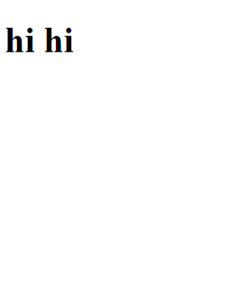

# JS Objects and Strings

This project was to teach us how to write strings, after of course, learning what strings were. I learned how to incorporate strings into objects and how objects and arrays worked. Arrays have [] brackets while objects have {} curly brackets. One is multiple, one is singular. You can read my array of objects if you would like. ;) We made up some fun information to test if statements, returning quote strings, functions and more. 

I accidentally smushed two different topics into one. Js-Arrays was supposed to be separate but I spaced and put it into this repo instead, so... There's just a lot going on and my screenshot gives none of that away. It just says hi hi. 

# Screenshot




# How to run this project

1. Use npm to install http-server in your terminal if you have not already:
```
npm install -g http-server
```

2. Run the server: 
```
hs -p 9999
```
3. Open Chrome and navigate to:
```
localhost:9999
```
